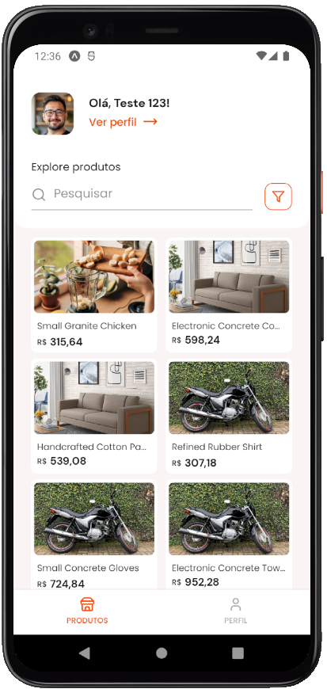
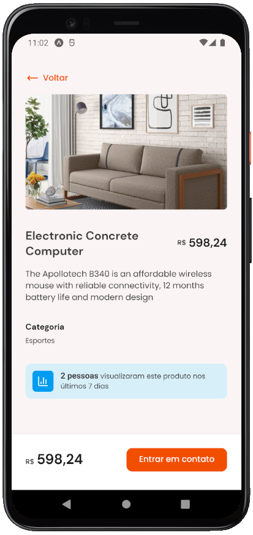
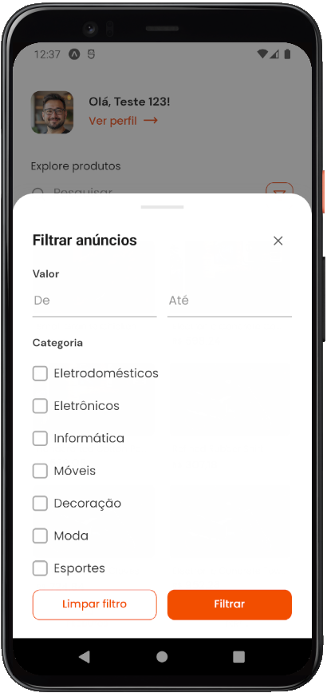

# Marketplace - mobile

<p align="center">
  
  
  
</p>
<p align="center">
  
  
  
</p>

<br>

## 💻 Projeto

**[Marketplace - mobile](https://github.com/AdrianoTobias/marketplace-mobile)**, é uma aplicação mobile com o framework Expo, voltada à marketplace, a qual engloba funcionalidades como listagem de produtos (com pesquisa e filtros por valor e categoria), detalhes do produto em si e possibilidade de entrar em contato com o vendedor através do WhatsApp. Tudo para engajar cada venda de produto. Além disso, permite a edição de perfil (imagem, dados e senha).

O projeto possui, ainda, autenticação e controle de acesso a rotas, bem como a implementação de cadastro de usuário.

É uma aplicação desenvolvida durante o **[MBA Fullstack](https://www.rocketseat.com.br/mba)**, provido pela **[Rocketseat](https://rocketseat.com.br/)**, em parceria com a **[Sirius Education](https://landing.sirius.education/home/)**.


## 🧪 Tecnologias

Esse projeto foi desenvolvido com as seguintes tecnologias:

- [React Native](https://reactnative.dev/)
- [Expo](https://expo.dev/)
- [Expo Router](https://docs.expo.dev/versions/latest/sdk/router/)
- [TypeScript](https://www.typescriptlang.org/)
- [Gluestack](https://gluestack.io/)
- [React Hook Form](https://react-hook-form.com/)
- [Axios](https://axios-http.com/)
- [Zod](https://zod.dev/)
- [Lucide Icons](https://lucide.dev/icons/)


## 🚀 Como executar

Clonar o projeto e acessar a pasta do mesmo:

```bash
$ git clone https://github.com/AdrianoTobias/marketplace-mobile.git
$ cd marketplace-mobile
```

Para iniciá-lo:
```bash
# Instalar as dependências
$ npm install
```

```bash
# Iniciar a aplicação
$ npx expo start
```
A aplicação poderá ser acessada via dispositivo (físico ou emulador), através do [Expo Go](https://docs.expo.dev/get-started/set-up-your-environment/).


As API's consumidas por esse projeto são providas por um servidor, o qual precisa ser baixado e executado, conforme sua respectiva [documentação](https://github.com/AdrianoTobias/marketplace-api).


## 🔖 Layout

O layout original do projeto pode ser visualizado no [Figma](http://figma.com/) através do link abaixo:

- [Layout Web](https://www.figma.com/community/file/1465783392558647927/app-de-marketplace) 


[Adriano Tobias](https://github.com/AdrianoTobias)